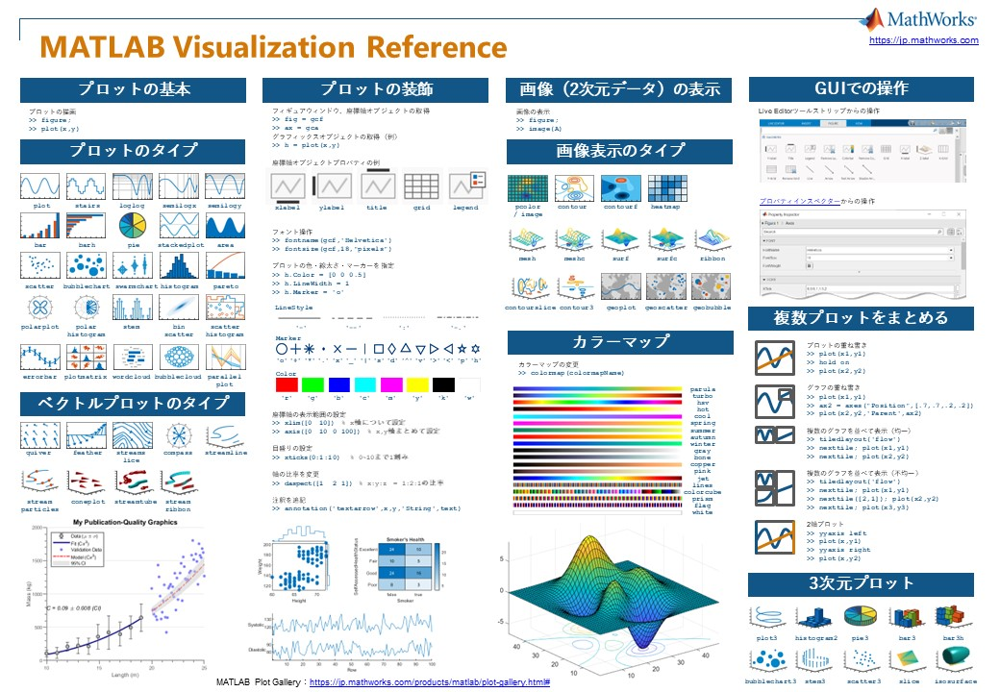

# Visualization Cheat Sheet

​​This repo provides a cheat sheet which contains essential tips in creating plots in MATLAB.​ 

このリポジトリは、MATLABでプロットを作成する際の主要な機能をまとめたチートシートを提供します。

English Version

日本語版

한국어 버전

Copyright (c) 2023, The MathWorks, Inc.
